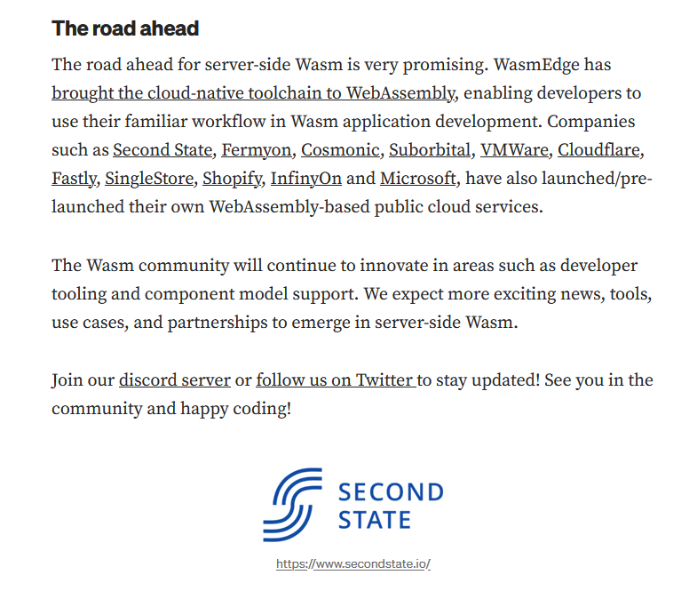

# Hello WasmEdge

Please [install the prerequisites](../README.md) first!

## Quick start with Docker

```
$ docker run --rm --runtime=io.containerd.wasmedge.v1 --platform=wasi/wasm secondstate/rust-example-hello:latest
Hello WasmEdge!
```
## Read the article WebAssembly on the server side. Take and submit a screenshot at the end of the article as part of the project deliverable.



## Code

The [`src/main.rs`](src/main.rs) source code shows

* A standalone Rust app must have a `main()` function as the entry point.
* In the `main()` function, we create a string. The string is `&str` type. In Rust, it is called a string slice meaning that this string is immutable.
* We print the string using the `println!()` marco. The `!` indicates that it is a macro, which is a set of functions to perform the task of printing to the OS console. The Rust compile expands the macro into a set of functions at compile time. There are many such macros in Rust and it is crucial that you learn them!
* Code was modified to include my Name in the console output.

## Step by step guide

Compile the Rust source code project to a Wasm bytecode file.

```
$ cargo build --target wasm32-wasip1 --release
```

Run the Wasm bytecode file in WasmEdge CLI.

```
$ wasmedge target/wasm32-wasip1/release/hello.wasm
Hello Christopher!
```

## Build and publish on Docker

The `Dockerfile` follows the above steps to build and package a lightweight OCI-compliant container image for the Wasm app.
Now, we need to publish the container image to Docker Hub. The process is slightly different depending on how you plan to use the image.

### For Docker Desktop and containerd

For containerd based systems, such as the Docker Desktop and many flavors of Kubernetes, 
you just need to specify that the WasmEdge application image is for the `wasi/wasm` platform.

```
$ docker buildx build --platform wasi/wasm -t secondstate/rust-example-hello .
... ...
$ docker push secondstate/rust-example-hello
```

